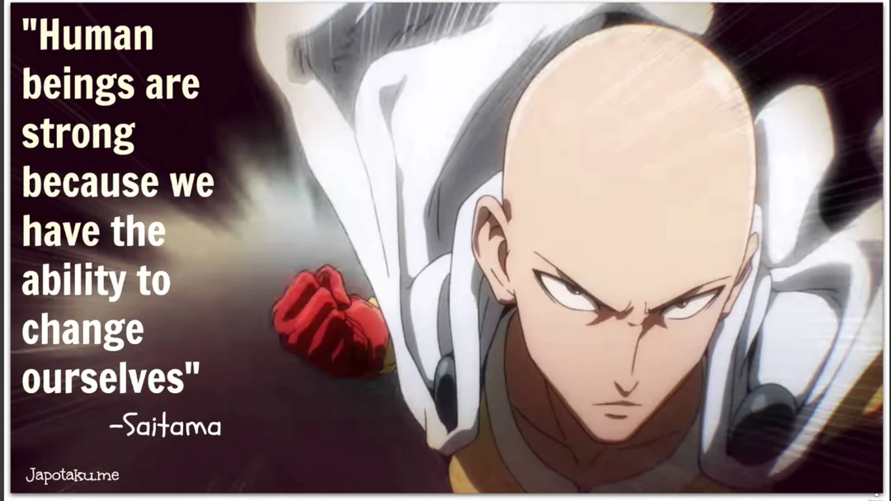

. i woke up today and immediately opted into my default program. Did i opt in, is there option in my action? Or was i simply following my programming. I picked up my phone and instead of allowing myself to feel the soreness of sleep, the dawning of my consciousness, before i could think-feel-be sad-remember who i am- i bombarded my nervous system with instagram reels. Today i started my morning by comparing my barely awake brain to the rest of the world. I got told like 5 times how i should deal with my depression and shame, 5 different ways i can make a business from my PASSIONS, saw several people mostly women that don;t look at all like any women i know in real life, and super ripped dudes that reminded me i am worthless because i don’t eat well or sauna enough or lift efficiently enough. I listened to strangers political opinions and then ended up seeing an old friend arguing with said strangers about words and stupid meanings. Is this the life i am missing out on? I a life of pleasure where people know you and you know them, you hook up with some random and can forget about it bc well your friends just told their stories of the rando they were with, your traumatic experience that u sat with for less than 2 minutes before u distracted yourself  that set of action that you keep trying to blame on a drunked drugged up stupor- i would never do that sober- that set of actions and decisions that make you feel like you let down that inner child you talk so much about healing. The trauma is normalized. It becomes celebrated as empowerment. Fuck the world- stay in bed. But when things go wrong blame the people doing things. You;re rich fuck you im not rich but want to be so fuck you. I woke up today and chose to ignore myself as i do most days. I hate people that ignore the truth and can;t interact directly with reality they shy away from any visceral feeling other than gold fish brain that likes scrolling and eating sugar. BUT i do that same thing. I already feel this at 23 almost 24- i dont want to wake up one day lift my head  up and look around and be in a world i can barely recognize because i have been distracting myself numbing myself into a dissociative state and i am too old to change anything. Why is it unbearable? I have been baring it and dont change it. The pain of change or the pain of staying the same?? Which is worse. At least i know this pain it is comforting bc it is predictable. I knew this would happen! Well yeah dude you pre planned this failure years ago. 

If you fail to plan you plan to fail. I guess i need to figure out what i really want. Instead of sitting in this hesitant expectant self loathing self isolated daily loop where victories just feel like a relief not an accomplishment. I want to feel again. At least i managed to stop scrolling, made myself some coffee, and started to write this.TIME to TAKE ACTION @ salva.

I want to be able to look at my life for the past 3 years, in a few months, i want to look back and think damn why wasn;t i living like this before.

What do i do? Jordan P says make a schedule, clean your room, clean yourself up.
That’s manageable. I can do that. I can choose. I can make intentional decisions. 

I desperately need more friends. I have make myself- no- allow myself to be more open to be social to be nicer. Less time talking to myself and more talking to others. I need to close the gap. I want to undeniably be the coolest person i know. That’s how i want to feel about myself. And in ways i do but i guess i need to actualize more of it and have a life that is evident of that. 

What does my ideal day look? The perfect daily day not a vacation day something i would be satisfied with doing daily no matter where i am. I do need to start planning and saving up for a move and need to figure out school and get another part time job and more freelance clients and new clothes that fit me and make me feel comfortable i need to brush my teeth with more toothpaste i use too little and i have to season my food more generously and live abundantly in actual life not a mental abundance of feeling derived from a social media feed. I have to stop living vicariously through online personas i want to real life a good life.

I am already filled with regret and i feel weak but i know this process will become self motivating and along the way it will get easier. I just have to show up for myself until this becomes my nature. 

